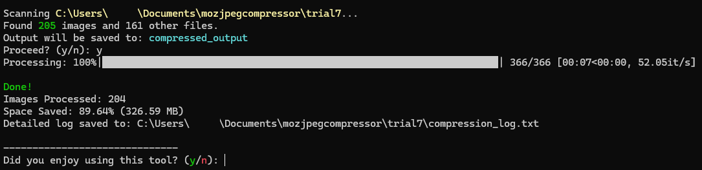

# Automated MozJPEG Compressor
A high-performance, multithreaded image compression utility built in Python and powered by Mozilla's advanced compression algorithm, MozJPEG.
Designed by Centenarium, assisted by ChatGPT and Gemini

## Project Overview
This project includes the necessary files for running the main **compressor.exe** program.
Both **compressor.exe** and **cjpeg** (the MozJPEG driver) must be in the same directory. 

Key features:

- Multithreaded execution
- Resume-safe
- Detailed logging and exception handling
- Fully deterministic compression
- Optional passthrough of non-image files

Supported image types:
- .png
- .jpg
- .jpeg

Unsupported files may be optionally copied over unchanged. 

## Usage
You may add all images you wish to compress to the same directory in no specific order
or simply paste your desired compression path (see Step 2).
All images found therein will be pooled for compression upon approval.

1. Launch **compressor.exe**. 
(Or open CMD in your folder and run `python compressor.py` if using the script. Check dependencies below). 
2. Paste desired path ("C:\Users\your_user\your_target_directory_here") or press Enter to select
all images from current directory.
3. Type desired compression quality or press enter to go with the default 87. The lower the number, 
the greater the compression. Recommended values for visual fidelity are anything north of 86
4. Choose whether to copy all non-image files into a 'non-images' folder alongside the compressed output. 
No compression will be applied to unsupported file types.
5. Confirm to begin compression. This may take a while.

A 'compressed_output' folder will be created alongside the source directory. 
Repeated runs will not override past results.

Results will vary based based on the chosen quality level. In the recommended settings you may  
generally reduce a batch of images to 15-30% of their original size while high maintaining visual fidelity.

To abort safely, press Ctrl+C. Closing the window may leave background processes running.

Recommended layout:

📂 Project folder

├─ ⚙️ compressor.exe   (Launcher)
├─ 🧩 cjpeg.exe        (MozJPEG binary)
└─ 📂 input_images     (Source images; folder hierarchy preserved in output)
   └─ ...               

## Why?
This was designed for tackling the archival and preservation of a large personal collection of images. Their immense size (14gb+) made it difficult to store them across devices. Using this script
I was able to compress them all to 20-30% of their original size while maintaining all visual fidelity and image dimensions. 

## Dependencies
### Option A — Standalone Executable (Recommended)
If using compressor.exe:

You only need:

    Windows 10 / 11
    MozJPEG (cjpeg.exe) placed in the same directory as compressor.exe

No Python installation is required.

### Option B — Python Script

To run the script through compressor.py, you must have:

1. Python 3.9+

Download:
https://www.python.org/downloads/

Verify:

python --version

2. Pip (comes with Python)

Verify:

pip --version

3. tqdm (progress bar)

Install:

pip install tqdm

4. MozJPEG (cjpeg)

Download cjpeg.exe from MozJPEG releases or from this repo and place it next to compressor.py.

