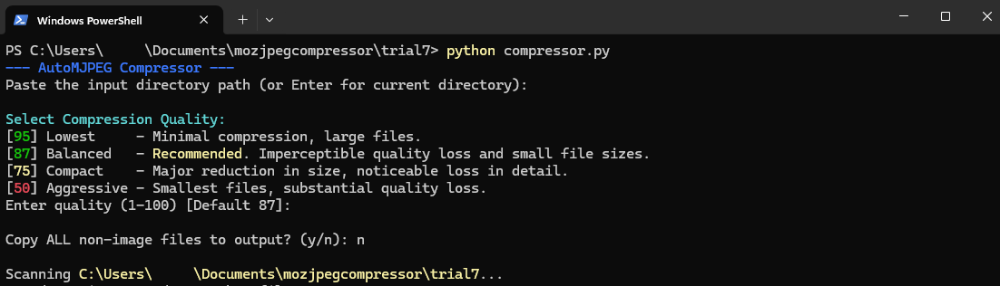

# AutoMozJPEG Compressor
A high-performance, multithreaded image compression utility built in Python and powered by the open-source MozJPEG encoder <br/>
Designed by Centenarium, assisted by ChatGPT and Gemini
<br/>

### Key features  

- Compress thousands of images to 20% of their original size in minutes with minimal detail loss
- Multithreaded execution
- Resume-safe
- Detailed logging and exception handling
- Fully deterministic compression
- Optional passthrough of non-image files
- No installation or external dependencies required  


Supported image types:
- ```.png```
- ```.jpg```
- ```.jpeg```


Unsupported files may be optionally copied over unchanged. 

## Usage
You may add all images you wish to compress to the same directory in no specific fashion
or simply paste your desired compression path (see Step 2). <br/>
All images found therein will be pooled for compression upon approval.
Both ```automozjpeg.exe``` and ```cjpeg.exe``` must be kept in the same directory.

<br/>



<br/>

### Steps

1. Launch **automozjpeg.exe**. <br/>
(Or open CMD in your folder and run `python automozjpeg.py` if using the script. Check dependencies below). 
2. Paste desired path ```(e.g., "C:\Users\your_user\your_target_directory_here")``` or <br/> press Enter to select all images from current directory.
3. Type desired compression quality or press Enter to go with the default 87. <br/> The lower the number, 
the greater the compression. <br/> Recommended values for visual fidelity are anything north of 86
4. Choose whether to copy all non-image files into a 'non-images' folder alongside <br/>
the compressed output. <br/>
No compression will be applied to unsupported file types.
5. Confirm to begin compression. This may take a while.

<br/>

A 'compressed_output' folder will be created alongside the source directory. 
Repeated runs will not override past results.

To abort safely, press Ctrl+C. Closing the window during compression may leave background processes running.

Recommended layout:

```
📂 Project folder

├─ ⚙️ automozjpeg.exe   (Launcher)
├─ 🧩 cjpeg.exe        (MozJPEG binary)
└─ 📂 input_images     (Source images; folder hierarchy preserved in output)
   └─ ...
```

## Why?
This was designed for tackling the archival and preservation of a large personal collection of images. <br/> Their immense size (14gb+) made it difficult to store them across devices. Using this script
I was able to compress them all to 20-30% of their original size while maintaining all visual fidelity and image dimensions. 


## Dependencies
### Option A — Standalone Executable (Recommended)
If using automozjpeg.exe:

You only need:

- Windows 10 or 11
- MozJPEG (cjpeg.exe) placed in the same directory as automozjpeg.exe

No Python installation is required.

### Option B — Python Script

To run the script through compressor.py, you must have:

1. Python 3.9+

Download:
https://www.python.org/downloads/

Verify:

```python --version```

2. Pip (comes with Python)

Verify:

```pip --version```

3. tqdm (progress bar)

Install:

```pip install tqdm```

4. MozJPEG (cjpeg)

Download cjpeg.exe from [MozJPEG releases](https://github.com/mozilla/mozjpeg/releases/tag/v4.1.1) or from this repo and place it next to automozjpeg.py.

Not affiliated with or endorsed by Mozilla.  
© 2026 Centenarium. All rights reserved.


